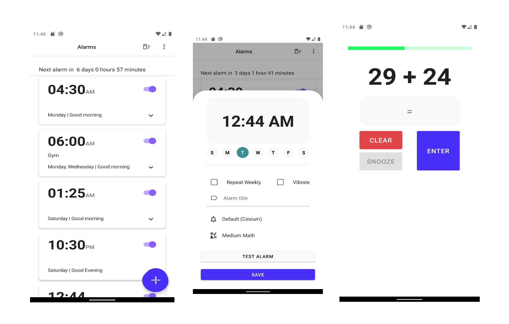

# Math Alarm :alarm_clock:

  

An Android alarm app in which you solve math problems of varying difficulty to dismiss alarm. Built with Kotlin, Room, Coroutines, the MVVM pattern with Clean architecture, ViewModel, Jetpack compose and some other libraries from the [Android Jetpack](https://developer.android.com/jetpack) .

<a href='https://play.google.com/store/apps/details?id=com.timilehinaregbesola.mathalarm'></a>

## Technologies used:

* [Jetpack Compose](https://developer.android.com/jetpack/compose) - Android’s modern toolkit for building native UI
* [ViewModel](https://developer.android.com/topic/libraries/architecture/viewmodel) to store and manage UI-related data in a lifecycle conscious way.
* [Navigation Material](https://google.github.io/accompanist/navigation-material) - provides Compose Material support for Jetpack Navigation Compose, features composable bottom sheet destinations.
* [Timber](https://github.com/JakeWharton/timber) - a logger with a small, extensible API which provides utility on top of Android's normal Log class.
* [Material Design](https://material.io/develop/android/docs/getting-started/)
* [Coroutines](https://kotlinlang.org/docs/reference/coroutines-overview.html) used to manage the local storage i.e. `writing to and reading from the database`. Coroutines help in managing background threads and reduces the need for callbacks.
* [Room](https://developer.android.com/topic/libraries/architecture/room) persistence library which provides an abstraction layer over SQLite to allow for more robust database access while harnessing the full power of SQLite.
* [Dagger Hilt](https://dagger.dev/hilt/) provides a standard way to incorporate Dagger dependency injection into an Android application.

## Installation
Math Alarm requires a minimum API level of 21. Clone the repository.

## Contribution
All contributions are welcome. Simply make a PR!

## LICENSE
```
MIT License

Copyright (c) 2020 Timilehin Aregbesola

Permission is hereby granted, free of charge, to any person obtaining a copy
of this software and associated documentation files (the "Software"), to deal
in the Software without restriction, including without limitation the rights
to use, copy, modify, merge, publish, distribute, sublicense, and/or sell
copies of the Software, and to permit persons to whom the Software is
furnished to do so, subject to the following conditions:

The above copyright notice and this permission notice shall be included in all
copies or substantial portions of the Software.

THE SOFTWARE IS PROVIDED "AS IS", WITHOUT WARRANTY OF ANY KIND, EXPRESS OR
IMPLIED, INCLUDING BUT NOT LIMITED TO THE WARRANTIES OF MERCHANTABILITY,
FITNESS FOR A PARTICULAR PURPOSE AND NONINFRINGEMENT. IN NO EVENT SHALL THE
AUTHORS OR COPYRIGHT HOLDERS BE LIABLE FOR ANY CLAIM, DAMAGES OR OTHER
LIABILITY, WHETHER IN AN ACTION OF CONTRACT, TORT OR OTHERWISE, ARISING FROM,
OUT OF OR IN CONNECTION WITH THE SOFTWARE OR THE USE OR OTHER DEALINGS IN THE
SOFTWARE.
```
