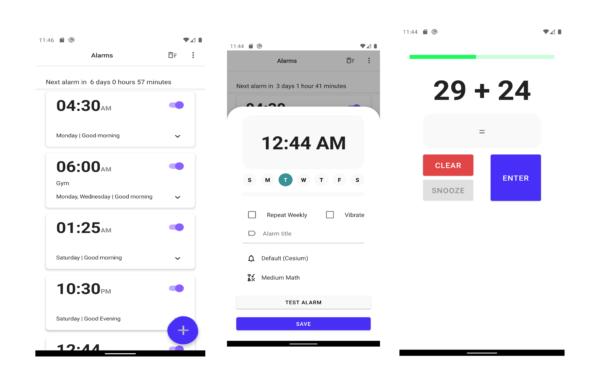

# Math Alarm :alarm_clock:

   [](https://github.com/acekyd/made-in-nigeria)

A **Kotlin Multiplatform** alarm app for Android and iOS where you solve math problems of varying difficulty to dismiss the alarm. Built with Compose Multiplatform, Clean Architecture, and modern KMP libraries.

<a href='https://play.google.com/store/apps/details?id=com.timilehinaregbesola.mathalarm'></a>

## Architecture

The project follows **Clean Architecture** with the **MVVM** pattern:

- **`:androidApp`** - Android application entry points, packaging, platform wiring, and Android resources
- **`:shared`** - Shared Compose UI, data layer, and Android/iOS platform implementations
- **`:core`** - Shared domain logic and business rules
- **`iosApp/`** - Native iOS application consuming the framework produced by `:shared`

## Technologies Used

### Kotlin Multiplatform
* [Kotlin Multiplatform](https://kotlinlang.org/docs/multiplatform.html) - Share code between Android and iOS
* [Compose Multiplatform](https://www.jetbrains.com/lp/compose-multiplatform/) - Declarative UI framework for both platforms

### UI & Navigation
* [Material 3](https://m3.material.io/) - Modern Material Design components
* [Navigation 3](https://developer.android.com/guide/navigation) - Jetpack Navigation for Compose Multiplatform
* [Compottie](https://github.com/alexzhirkevich/compottie) - Lottie animations for Compose Multiplatform

### Data & Storage
* [Room KMP](https://developer.android.com/kotlin/multiplatform/room) - Multiplatform database with SQLite
* [Multiplatform Settings](https://github.com/russhwolf/multiplatform-settings) - Key-value storage across platforms
* [Kotlinx Serialization](https://github.com/Kotlin/kotlinx.serialization) - JSON serialization

### Dependency Injection
* [Koin](https://insert-koin.io/) - Lightweight dependency injection framework for KMP

### Async & Reactive
* [Coroutines](https://kotlinlang.org/docs/coroutines-overview.html) - Asynchronous programming
* [Kotlinx DateTime](https://github.com/Kotlin/kotlinx-datetime) - Multiplatform date/time library

### Logging & Analytics (Android)
* [Kermit](https://github.com/touchlab/Kermit) - Multiplatform logging library
* [Firebase Analytics](https://firebase.google.com/docs/analytics) - App analytics
* [Firebase Crashlytics](https://firebase.google.com/docs/crashlytics) - Crash reporting

### Localization
* [Lyricist](https://github.com/adrielcafe/lyricist) - Type-safe string localization for Compose

### Testing

See [the testing guide](docs/testing.md) for host suites, real-device lifecycle checks, CI, and physical-device release validation.
* [Kotlin Test](https://kotlinlang.org/api/latest/kotlin.test/) - Multiplatform testing
* [Turbine](https://github.com/cashapp/turbine) - Flow testing
* [Kotest](https://kotest.io/) - Assertions library
* [MockK](https://mockk.io/) - Mocking library (Android)

## Installation

Math Alarm requires a minimum API level of **26** (Android 8.0+).

```bash
# Clone the repository
git clone https://github.com/t-regbs/MathAlarm.git

# Open in Android Studio or IntelliJ IDEA
```

### Building for iOS
The iOS app is located in the `iosApp/` directory and consumes the framework produced by `:shared`. Open the Xcode project to build and run on iOS devices/simulators.

## Contribution
All contributions are welcome. Simply make a PR!

## LICENSE
```
MIT License

Copyright (c) 2025 Timilehin Aregbesola

Permission is hereby granted, free of charge, to any person obtaining a copy
of this software and associated documentation files (the "Software"), to deal
in the Software without restriction, including without limitation the rights
to use, copy, modify, merge, publish, distribute, sublicense, and/or sell
copies of the Software, and to permit persons to whom the Software is
furnished to do so, subject to the following conditions:

The above copyright notice and this permission notice shall be included in all
copies or substantial portions of the Software.

THE SOFTWARE IS PROVIDED "AS IS", WITHOUT WARRANTY OF ANY KIND, EXPRESS OR
IMPLIED, INCLUDING BUT NOT LIMITED TO THE WARRANTIES OF MERCHANTABILITY,
FITNESS FOR A PARTICULAR PURPOSE AND NONINFRINGEMENT. IN NO EVENT SHALL THE
AUTHORS OR COPYRIGHT HOLDERS BE LIABLE FOR ANY CLAIM, DAMAGES OR OTHER
LIABILITY, WHETHER IN AN ACTION OF CONTRACT, TORT OR OTHERWISE, ARISING FROM,
OUT OF OR IN CONNECTION WITH THE SOFTWARE OR THE USE OR OTHER DEALINGS IN THE
SOFTWARE.
```
