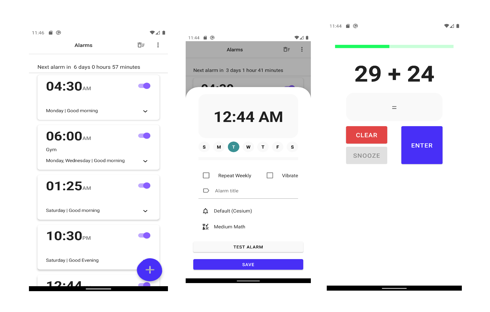

# Math Alarm :alarm_clock:

   [](https://github.com/acekyd/made-in-nigeria)

A **Kotlin Multiplatform** alarm app for Android and iOS where you solve math problems of varying difficulty to dismiss the alarm. Built with Clean Architecture and shared Kotlin ViewModels, Android Compose, and a native SwiftUI development UI.

<a href='https://play.google.com/store/apps/details?id=com.timilehinaregbesola.mathalarm'></a>

## Architecture

The project follows **Clean Architecture** with the **MVVM** pattern:

- **`:androidApp`** - All Compose screens/navigation/theme/localization/resources, application entry points and Android platform wiring
- **`:shared`** - UI-free feature ViewModels, application coordination, data and platform service adapters
- **`:core`** - Shared domain logic and business rules
- **`iosApp/`** - SwiftUI screens and session/navigation owners consuming the `app` framework produced by `:shared`

The native migration uses shared Kotlin ViewModels and alarm logic with Compose on Android and SwiftUI on iOS. All native parity screens are implemented. Permanent XCTest/UI targets, native client flows, renderer/resource gates and archive checks are documented in [architecture and build](docs/native-architecture.md) and [testing](docs/testing.md). [Migration progress](docs/native-ui-migration-progress.md) separates implementation evidence from physical AlarmKit, acoustic, minimum-runtime and release acceptance gates. This development build is not yet release ready.

## Technologies Used

### Kotlin Multiplatform
* [Kotlin Multiplatform](https://kotlinlang.org/docs/multiplatform.html) - Share code between Android and iOS
* [Compose Multiplatform](https://www.jetbrains.com/lp/compose-multiplatform/) - Android declarative UI renderer

### UI & Navigation
* [Material 3](https://m3.material.io/) - Modern Material Design components
* [Navigation 3](https://developer.android.com/guide/navigation) - Android Compose navigation
* [Compottie](https://github.com/alexzhirkevich/compottie) - Android Compose Lottie animations

### Data & Storage
* [Room KMP](https://developer.android.com/kotlin/multiplatform/room) - Multiplatform database with SQLite
* [Multiplatform Settings](https://github.com/russhwolf/multiplatform-settings) - Key-value storage across platforms
* [Kotlinx Serialization](https://github.com/Kotlin/kotlinx.serialization) - JSON serialization

### Dependency Injection
* [Koin](https://insert-koin.io/) - Lightweight dependency injection framework for KMP

### Async & Reactive
* [Coroutines](https://kotlinlang.org/docs/coroutines-overview.html) - Asynchronous programming
* [Kotlinx DateTime](https://github.com/Kotlin/kotlinx-datetime) - Multiplatform date/time library

### Logging & Analytics (Android)
* [Kermit](https://github.com/touchlab/Kermit) - Multiplatform logging library
* [Firebase Analytics](https://firebase.google.com/docs/analytics) - App analytics
* [Firebase Crashlytics](https://firebase.google.com/docs/crashlytics) - Crash reporting

### Localization
* [Lyricist](https://github.com/adrielcafe/lyricist) - Type-safe string localization for Compose

### Testing

See [the testing guide](docs/testing.md) for host suites, real-device lifecycle checks, CI, and physical-device release validation.
* [Kotlin Test](https://kotlinlang.org/api/latest/kotlin.test/) - Multiplatform testing
* [Turbine](https://github.com/cashapp/turbine) - Flow testing
* [Kotest](https://kotest.io/) - Assertions library
* [MockK](https://mockk.io/) - Mocking library (Android)
* XCTest / XCUITest - Production framework, native owners, navigation and fresh-process restoration
* Maestro - Native client flows and software-keyboard/accessibility-size evidence

## Installation

Math Alarm requires a minimum API level of **26** (Android 8.0+).

```bash
# Clone the repository
git clone https://github.com/t-regbs/MathAlarm.git

# Open in Android Studio or IntelliJ IDEA
```

### Building for iOS
The iOS app supports iPhone and iPad running iOS/iPadOS **26 or later**. The current build is verified locally with Xcode 27.0 and JDK 21. Open the shared `iosApp` scheme in `iosApp/iosApp.xcodeproj`, or run:

```bash
./gradlew :core:iosSimulatorArm64Test :shared:iosSimulatorArm64Test --continue
xcodebuild -project iosApp/iosApp.xcodeproj -scheme MathAlarmNative -configuration Debug \
  -destination 'generic/platform=iOS Simulator' CODE_SIGNING_ALLOWED=NO build
```

The PR workflow runs permanent native tests, client flows, nine-locale screenshots and archive packaging on the GitHub-hosted `xcode-27` Apple Silicon image, explicitly selecting Xcode 27.0 (27A266a). Use iPad simulators for layout/navigation checks and a physical iPhone for AlarmKit delivery and audio validation. Signed device builds require your Apple development team and provisioning profile; a simulator build does not establish alarm delivery reliability.

## Contribution
All contributions are welcome. Simply make a PR!

## LICENSE
```
MIT License

Copyright (c) 2025 Timilehin Aregbesola

Permission is hereby granted, free of charge, to any person obtaining a copy
of this software and associated documentation files (the "Software"), to deal
in the Software without restriction, including without limitation the rights
to use, copy, modify, merge, publish, distribute, sublicense, and/or sell
copies of the Software, and to permit persons to whom the Software is
furnished to do so, subject to the following conditions:

The above copyright notice and this permission notice shall be included in all
copies or substantial portions of the Software.

THE SOFTWARE IS PROVIDED "AS IS", WITHOUT WARRANTY OF ANY KIND, EXPRESS OR
IMPLIED, INCLUDING BUT NOT LIMITED TO THE WARRANTIES OF MERCHANTABILITY,
FITNESS FOR A PARTICULAR PURPOSE AND NONINFRINGEMENT. IN NO EVENT SHALL THE
AUTHORS OR COPYRIGHT HOLDERS BE LIABLE FOR ANY CLAIM, DAMAGES OR OTHER
LIABILITY, WHETHER IN AN ACTION OF CONTRACT, TORT OR OTHERWISE, ARISING FROM,
OUT OF OR IN CONNECTION WITH THE SOFTWARE OR THE USE OR OTHER DEALINGS IN THE
SOFTWARE.
```
