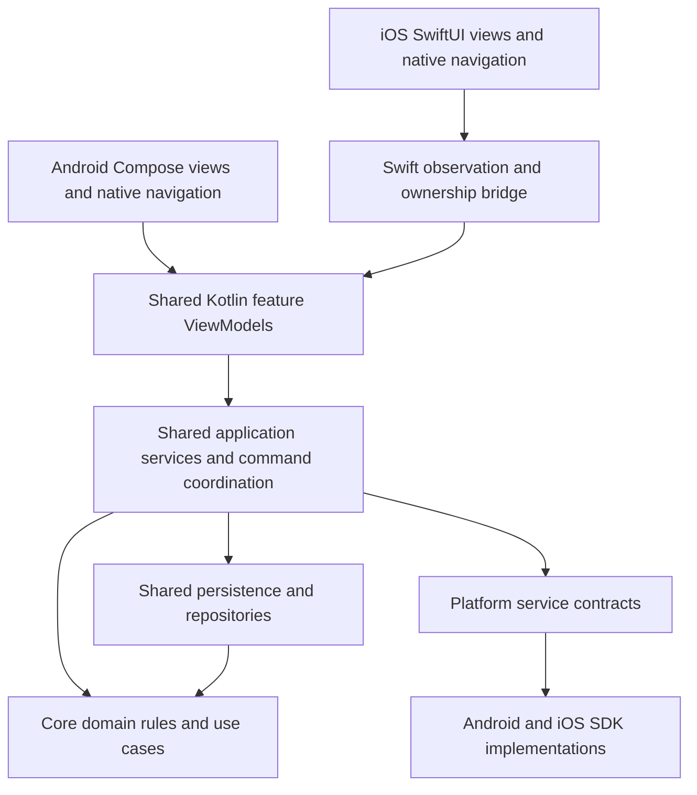

# MathAlarm native UI migration plan

**Decision approved on 2 October 2026. Milestones 1–4 are complete against their documented gates; Milestone 5 is the next implementation scope. [Implementation progress and handoff](native-ui-migration-progress.md).**

MathAlarm will keep Clean Architecture and MVVM, share Kotlin domain, application, data, and feature ViewModel logic through KMP, and present that logic with **Compose on Android and SwiftUI on iOS**. The shared boundary includes the ViewModels. Native code owns navigation, controls, layout, accessibility, and visual presentation.

This is a direct migration to the final architecture. When native iOS UI implementation begins, the development app root becomes SwiftUI and all new iOS screens are SwiftUI. There is no phase that embeds Compose screens in a SwiftUI shell, and no partially migrated iOS release. Work is ordered by dependencies so the existing Android app remains usable and alarm behavior remains testable throughout.

The [research and retained experiment results](research/native-ui-interop-2026-10-02/README.md) establish the interop decision and its limits. This plan records the target architecture, implementation order, feature parity, and acceptance gates. It does not mark existing iOS release risks as resolved.

## Locked architecture



The arrows show calls and data consumption. Platform implementations are injected through contracts; domain code does not depend on an application or UI framework.

One shared ViewModel means **one implementation per feature**, instantiated for the appropriate screen or session on each platform. It does not mean one global ViewModel for the entire app. Android and iOS have their own runtime instances using the same behavior.

| Layer | Shared responsibility | Native responsibility |
| --- | --- | --- |
| Presentation | Feature state, draft validation, loading/saving/errors, sorting, challenge progression, semantic actions and results | Rendering, navigation stacks and selection, sheets, toolbar placement, keyboard/focus/cursor, animations and accessibility |
| Application | Coordinating commands, durable occurrence sessions, scheduling reconciliation, persistence and service orchestration | App/scene lifecycle entry points, durable native delivery queue, SDK callbacks and intent execution |
| Domain | Alarm and occurrence rules, recurrence/time calculations, maths generation and answer checking, snooze rules | Platform capability facts supplied to shared rules |
| Data and services | Room repositories, preferences, progress records, service interfaces | AlarmKit, Android alarm delivery, permissions, audio session/player, haptics, sharing and external app presentation |

An SDK implementation can remain in Kotlin `androidMain` or `iosMain` where it already works well. Native SwiftUI does not require rewriting Room, Foundation adapters, or all iOS service implementations in Swift. Swift owns services that need Swift SDK APIs and AppIntents; both languages use the same contracts.

## Module ownership and dependency rules

Retain the existing three Gradle modules and the Xcode application. Introduce packages for clear ownership before adding more modules.

| Location | Final contents |
| --- | --- |
| `core` | UI-free domain models, recurrence/occurrence/maths rules, use cases, and existing domain-facing repository and service contracts |
| `shared` | UI-free feature ViewModels/state/actions, application coordination, Room/data/preferences, portable analytics and capability contracts, and non-UI platform adapters |
| `androidApp` | All Compose screens and navigation, Material/adaptive components, Android theme/resources/localization, activity-result and permission UI, existing Android app/service/receiver wiring |
| `iosApp` | All SwiftUI screens and navigation, feature/session owners, native localization/assets, app/scene wiring, AlarmKit/AppIntents and Swift platform adapters |

`shared` depends on `core`; the apps consume `shared` and the domain types needed by their contracts. Neither shared module depends on an app module. `core` has no presentation dependency. `shared/commonMain` has no Compose, SwiftUI, UIKit, Android Context, native navigation, or UI resource dependency. OS-specific dependencies belong to platform source sets or the applications.

Move the existing shared Compose views, components, navigation, theme, icons, animations, renderer tests, Compose resources, and Lyricist UI catalogs into `androidApp`. Preserve Android behavior while moving them. Split `PlatformApis.kt`: SDK/service contracts remain shared; composable launchers, permission dialogs, email/share presentation, and composition locals move to native UI owners.

Keep the static framework's current `app` name initially. Export only the public feature API, required domain DTOs, and observable base types. Make required exported dependencies explicit; avoid broad transitive exports of Koin, repositories, or UI libraries. Remove the unused Alpha Swift export DSL and CALF framework export as part of the UI extraction. Naming cleanup is not a prerequisite for the migration.

## Interop and dependency decision

Use the framework/Objective-C export path already used by Xcode, with **KMP-ObservableViewModel 1.1.0** and **KMP-NativeCoroutines 1.0.6**. Start with the experimentally verified **Kotlin 2.4.20, Coroutines 1.11.0, and JetBrains Lifecycle 2.11.0** combination. Kotlin and Swift bridge versions must match, and Gradle resolution plus Swift package resolution must be pinned and reviewed together.

These coroutines/lifecycle versions exceed the bridge libraries' published baseline. The experiment passed on this resolved combination, so retain it with production framework, observation, cancellation, and cleanup checks rather than assuming compatibility from the version numbers alone. Dependency upgrades must pass those checks before adoption. [Verified versions and compatibility limits](research/native-ui-interop-2026-10-02/README.md#toolchain-and-release-research).

Use the ObservableViewModel `MutableStateFlow(viewModelScope, ...)` and `stateIn` variants where notification to SwiftUI is required. Apply NativeCoroutines annotations and generated accessors consistently. Use `@StateViewModel` at the SwiftUI owner and `@ObservedViewModel` in children. Swift adapters may convert interop types and bind native controls; they must not implement validation, saving, maths progression, or scheduling again.

Native Swift export remains deferred. Its final facade passed 11 checks, but directly exporting the AndroidX ViewModel failed to link and the successful Swift 6 runs needed a compatibility import. Revisit when exporter stability, the lifecycle failure, strict concurrency, packaging, and the full production API meet the same integration gates. Changing the bridge later must not change the shared presentation boundary. [Comparison evidence](research/native-ui-interop-2026-10-02/README.md#native-swift-export-comparison).

## Shared state and action contracts

Create immutable feature state for the alarm list, alarm editor, maths challenge, and app preferences. Add separate shared models only when a feature has meaningful behavior; a static About or sound list does not need a ViewModel just for symmetry.

- Convert preference storage observability to Flow before the list model, which currently depends on `snapshotFlow`.
- Replace Compose `State`, `MutableState`, `TextFieldValue`, and mutable public setters with Kotlin values and read-only `StateFlow` state. Title/answer text is a string; selection, marked text, focus, and keyboard state stay native.
- Share validation, initial-draft comparison, dirty state, normalized challenge/snooze values, loading, pending operations, accepted results, and typed errors. Native views dispatch semantic actions such as editing the title, choosing a sound, saving, answering, or snoozing.
- Keep public contracts concrete and easy to consume from Swift. Do not expose Kotlin UI route classes, Compose resources, localized snackbar text, Koin containers, or generic repository infrastructure.
- Represent business failures with semantic codes and arguments. Native code supplies localized copy, date/time/number formatting, and the appropriate alert/banner/snackbar.
- Retain important command outcomes in state or return explicit results. A temporary loss of observers must not lose a save failure or accepted completion. If effects need acknowledgement, give them stable IDs and define replay/acknowledgement behavior. Shared results describe what happened; native navigation decides where to go.

Keep one application DI container and one command coordinator. Export a narrow bootstrap and feature factory facade for Swift. Construct editor models by a stable draft/session ID and challenge models by occurrence identity; do not recreate them in SwiftUI `body` or a changing detail branch.

## Ownership and durable alarm behavior

The editor owner survives compact/expanded transitions, rotation, picker/subpage navigation, and Test Alarm. It ends when its draft is explicitly saved/discarded and its editing session closes. The list has a window/navigation owner. The real challenge binds to a durable occurrence session and can be observed by replacement native views without restarting its work.

Removing a view cancels observation and screen-only work. It must not silence a real alarm, clear unresolved progress, cancel recovery, or abort an accepted durable command. Accepted save/schedule/complete/snooze operations execute in the application command service and return authoritative results. ViewModels observe those results. Preserve `Usecases.command` serialization across UI, receivers, intents, and recovery paths.

Move behavior currently triggered from Compose effects into application services before deleting the screens: real/preview audio start arbitration, occurrence initialization/consumption, completion, snooze, recovery cancellation, and progress persistence. Do not gate these services on `WhileSubscribed` or on a SwiftUI `.task` remaining alive.

Keep one audio owner. Existing `IosAlarmAudioManager` can remain the iOS implementation; views do not create competing AVAudioPlayers. Sound preview, Test Alarm, and a delivered alarm need explicit arbitration. Closing a preview stops its preview audio; closing/replacing a real challenge view does not complete its occurrence.

Preserve these invariants:

1. Register scheduler/AlarmKit bridge and initialize shared services before reconciliation or processing a handoff. Prewarm storage without depending on creation of a Compose controller.
2. Replay the durable ordered `PendingDeeplinkStore` queue, validate against the authoritative saved alarm, and initialize the matching occurrence. Acknowledge only after the challenge is actually ready. Retain retryable failure; reject obsolete/deleted/disabled deliveries explicitly.
3. Use explicit initializing/ready/error state. The current challenge initialization can cache its key after a failed load and then report success on a repeated call. Fix that behavior and test failed initialization followed by retry before connecting native acknowledgement.
4. Preserve stable occurrence identity, `activeAt` stale-command guards, once-only consumption, and exact persisted problems/index/start time/incorrect-answer count. Resolve the existing same-recurring-alarm queue identity collision before release acceptance.
5. Stop audio and cancel recovery only after accepted completion/snooze or a successful edit/disable/delete that invalidates the occurrence. A failed or stale command leaves the unresolved session visible and recoverable.
6. Preserve continuous 60-second recovery until resolution, recovery token invalidation, and cancellation of an in-flight native registration. Present recovery registration failures through application state.
7. Give delivered alarms priority over settings, editors, and previews without silently discarding an unsaved draft. Return to the retained draft after the occurrence resolves.
8. Keep the currently presented real challenge until it resolves; retain later valid deliveries durably in delivery order. Later handoffs stay unacknowledged until their own challenge is ready to present. Do not replace an unresolved challenge when the queue advances. The coordinator owns audio arbitration and recovery per occurrence, so resolving one occurrence cannot silence another or cancel another token. Repeated handoffs for the active occurrence restore its session without restarting progress.
9. Persist the unresolved occurrence before acknowledging its handoff. On launch, restore unresolved application sessions as well as the pending native queue: termination after acknowledgement must not lose a challenge whose payload is no longer queued.

Keep the existing Room database names, version 9 schema/migrations, preference keys, announcement IDs, sound IDs, platform registration IDs, and persisted progress formats. A UI migration does not require a data reset. If resolving handoff identity requires a new payload format, version it and define handling of existing queued payloads; never clear the queue as a migration shortcut.

## Native iOS presentation

Use standard SwiftUI navigation and controls so the OS supplies toolbar, material, safe-area, and accessibility behavior. Apple recommends standard system components for Liquid Glass, removing interfering custom bar backgrounds, and testing transparency/motion accessibility settings. [Apple Liquid Glass adoption guidance](https://developer.apple.com/documentation/technologyoverviews/adopting-liquid-glass).

Our implementation choices are:

- A `NavigationSplitView` for the alarm list and selected alarm/editor when space allows, with native stack presentation in compact layouts. Selection and draft owners sit above layout changes. Adapt to available width/window size rather than detecting a Duo model or a hinge offset.
- List actions such as Add and Settings belong to the list toolbar. Editor Save and Cancel use confirmation/cancellation roles in the editor's navigation context. Let the system place and group toolbar items, then validate on closed/open Duo and iPad; there is no assumption that every action belongs at one hard-coded right edge.
- Use native `List`, `Form`, `DatePicker`, pickers/toggles, sheets, popovers, alerts, confirmation dialogs, menus, and sharing presentation. Use SF Symbols with accessible labels where suitable.
- Remove blanket `ignoresSafeArea` and the Compose controller wrapper. Permit decorative backgrounds to extend deliberately while interactive content uses native safe areas. Each column fills its container vertically; no manual status-bar arithmetic or fixed screen-height calculations.
- Keep glass treatment in native navigation/controls. Preserve the app's identity through restrained colors, icons, content, and the maths challenge rather than applying glass to every card.

Validate iPhone and iPad on the minimum supported iOS 26 and the current SDK/runtime, including resizing and keyboard use. Duo validation covers closed/open in portrait and landscape, plus transitions with list, editor, custom settings, sound preview, Test Alarm, and real challenge active. Check both toolbar action placement and full left-pane height. A synthetic detail replacement test remains useful but does not replace the manual fold test.

Create native String Catalogs for all nine existing locales, retaining semantic feature/announcement IDs. Keep Android's existing catalogs in Android UI. Share data and error meaning, while each platform renders native plural/date/time/number forms. Preserve the six bundled iOS tones and missing-tone fallback.

Keep current platform capability differences: Skip Next and review prompting remain Android features; iOS has no vibration toggle; AlarmKit countdown snooze remains disabled and maths-screen snooze stays authoritative. Preserve Android review eligibility, permission flows, service behavior, and analytics contracts.

## Required feature parity

| Feature | Required behavior before migration acceptance |
| --- | --- |
| Alarm list | Loading/empty/list, current sort modes, enable/disable, create/edit/selection, delete with undo, clear confirmation, truthful scheduling/cancellation errors |
| Alarm editor | Time, weekdays/repeat, label, enabled state, challenge, snooze interval/maximum, sound; Save/Cancel, draft comparison, discard confirmation, failure/retry and duplicate-action guards |
| Challenge settings | Easy/Medium/Hard/Custom, 1–10 questions, operation/range normalization, difficulty mixing, retained draft on nested navigation |
| Sound library | Six bundled tones, stable IDs/fallback, selection separate from preview playback, Back/Done/discard behavior, interruption by real alarm |
| Test Alarm | Uses unsaved editor draft, wrong answers and multiple questions, preview-only progress/audio, cancel/success returns to the same draft |
| Delivered challenge | Durable handoff, authoritative occurrence, restored progress, looping audio/recovery, wrong/correct answers, accepted completion/snooze, command failure/stale result handling |
| App settings | Light/Dark/System, sort preference, What's New and persistent acknowledgement, feedback/share, existing platform-specific visibility |
| Cross-cutting | All locales, native date/time and accessibility, keyboard/Dynamic Type, dark contrast, launch presentation, iPhone/iPad/Duo adaptation, existing data and analytics compatibility |

## Implementation sequence and gates

Each milestone is a reviewable change toward the final architecture. The gates are completion criteria, not permission checkpoints. Existing production features stay the reference; incomplete native development builds do not establish release readiness.

### Milestone 1 Record the baseline

Capture production behavior and contracts before moving files. Inventory screens, routes, resources, native hooks, public framework APIs, database/preferences, analytics, capabilities, and current release issues. Record reference screenshots for Android compact/tablet and iOS closed/open/iPad where available. Preserve the research archive as the decision record.

Run the existing host/shared/platform suites and capture failures independently of the migration. Add focused regressions for the identified failed-initialization retry and occurrence/handoff identity where missing. Record the supported device/toolchain matrix.

**Gate:** a concrete parity checklist, baseline test results, and known reliability issues distinguish existing behavior from migration regressions.

### Milestone 2 Make shared presentation and operations independent of UI

Convert preferences to Flow, then list, editor, challenge, and settings presentation to immutable shared state/actions. Adopt the verified bridge dependencies and factories. Adapt the current Android Compose consumers to these contracts, preserving behavior.

Extract application command/challenge coordination from screen effects. Define lifetime/cancellation rules for durable commands and preview work. Extract Koin startup, database prewarming, `resumeAlarmSchedules`, and `createAlarmHandoffJson` from `MainViewController.kt` into a UI-free iOS facade; update native callers. Split service ports from presentation APIs and fix initialization readiness/retry semantics.

Build production iOS frameworks and test real production feature APIs from Swift. Turn the successful experimental observation, cancellation, owner removal, and layout-retention checks into focused production tests. The archive remains results-only; do not reintroduce standalone experiment projects.

**Gate:** shared feature behavior has no Compose types; Android uses the new models; bootstrap works without creating a UI controller; accepted commands survive observer removal; production bridge tests pass on pinned dependencies.

### Milestone 3 Move Android UI and establish the SwiftUI root

Move Compose renderers, navigation, resources, localization, and UI tests into `androidApp`. Update packages/imports/Gradle dependencies together. Keep Android route identity, test tags, draft ownership, activity-result behavior, foreground service/receiver behavior, and resources stable.

In the same coordinated extraction, replace the iOS Compose root with a native SwiftUI root and native session/route owners. Remove the representable/Compose controller, broad safe-area overrides, iOS Compose navigation, and CALF integration. Configure Swift packages and the narrow application facade; remove UI libraries and the unused Swift export configuration from `shared`.

Start the native list and split/stack navigation against the shared list model. All further iOS screens are native. Features completed in later milestones can be incomplete during development; there is no Compose fallback. Pending real handoffs remain unacknowledged until native challenge readiness is implemented.

**Gate:** Android builds with Compose confined to Android UI; `shared` compiles without UI renderer dependencies; the iOS app builds and launches through SwiftUI and UI-free startup; native owner tests preserve draft identity through layout replacement.

### Milestone 4 Complete the native list and editing flow

Finish list states/actions/selection, CRUD/toggles/delete undo/clear, and error presentation. Build the native editor with its time/day/repeat/label controls, challenge settings, snooze settings, sound library, save results, and unsaved-draft protection. Keep nested editors and pickers in the same session.

Port native localization and accessibility for these screens as they are implemented. Validate standard toolbar roles, dark appearance, keyboard avoidance, Dynamic Type, full pane height, and compact/expanded behavior.

**Gate:** list/editor/subpage/sound behavior meets the parity table; failure/retry and duplicate actions are correct; closed/open layout and navigation retain drafts; Android editor/tablet tests still pass.

### Milestone 5 Complete preview and delivered alarm flows

Implement the native maths challenge with the shared model, first exercising preview from the editor and then the real occurrence service. Connect durable queue replay/acknowledgement, launch/scene activation, AppIntents, schedule reconciliation, progress restoration, audio, completion, snooze, and continuous recovery.

Resolve stable delivery identity and retry readiness before enabling real handoff acceptance. Test interruption of an editor/preview by a real alarm and return to its draft. Test two unresolved real occurrences, their ordered presentation and audio/recovery isolation, and termination after acknowledgement but before resolution. Report native scheduling/recovery failures through shared application state rather than logging alone.

**Gate:** preview cannot mutate a real occurrence; successful readiness precedes acknowledgement; duplicate/stale/failed commands preserve the correct session; accepted resolution cancels audio/recovery; persisted progress and pending handoffs survive restart. Physical recovery gates remain required even when simulator tests pass.

### Milestone 6 Finish settings and native presentation parity

Complete theme/sort, What's New, feedback/share and all remaining localized presentation. Preserve native capability visibility and Android-only review/Skip Next behavior. Replace any remaining iOS Compose animation/resource usage with appropriate native assets or views. Finish launch visuals and accessibility across every screen.

**Gate:** every feature in the parity table is implemented natively on iOS; nine locale catalogs and sound resources are packaged; permission and sharing flows behave correctly on iPhone/iPad; no omitted feature is disguised by a development placeholder.

### Milestone 7 Enforce boundaries and integrate CI

Remove dead iOS Compose/CALF code, compatibility shims, and unused dependencies/build flags. Update README, developer build instructions, architecture docs, testing guide, and Maestro/native accessibility flows to the final implementation. Preserve Room schema generation and non-UI platform tests.

Add an Xcode unit/UI test target and CI steps for framework consumption, observation/lifetime, native navigation, and handoff behavior. Keep existing Android host/delivery/native KMP suites. Pin Swift packages; verify Debug and Release device/simulator linking and archive resources/privacy manifest. Add a simple dependency/import check so Compose cannot return to shared production sources.

**Gate:** shared production code and iOS dependency graph contain no Compose/CALF renderer; CI validates both native UIs and shared behavior; release archive packaging succeeds; documentation describes the implemented architecture.

### Milestone 8 Validate devices and release readiness

Complete the layout, lifecycle, delivery, recovery, audio, storage upgrade, and physical-device matrix below. Resolve failures rather than accepting simulator builds as proof. Reconcile the existing release-readiness document with measured results and retained evidence.

**Gate:** all migration criteria and existing iOS release blockers are closed with evidence. Only then is the full native iOS version ready for its first release. Submission/publication is a separate action from this plan.

## Verification strategy

Keep current commands as the starting baseline; update task/file locations when code moves:

```bash
./gradlew :core:testAndroidHostTest :shared:testAndroidHostTest :androidApp:testDebugUnitTest --continue
python3 -B -m unittest discover -s scripts -p '*_test.py'
./gradlew :core:iosSimulatorArm64Test :shared:iosSimulatorArm64Test --continue
```

| Area | Required evidence |
| --- | --- |
| Shared rules and presentation | Existing suites plus meaningful regressions for validation/normalization, save/retry/duplicate guards, durable command lifetime, readiness retry, occurrence identity, stale guards, preview isolation and restored progress |
| Swift interop and ownership | Actual production framework/state APIs, mounted SwiftUI owner removal, observed children, task/Flow cancellation, stable editor owner across detail changes, and no observer-dependent alarm work |
| Native iOS UI | List/editor/settings/sound/preview/challenge flows; failure presentation; localization; Dynamic Type, VoiceOver, Reduce Motion/Transparency, light/dark; selected alarm/draft retention |
| Adaptive layout | Manual Duo closed/open and transitions in both orientations, iPhone compact, iPad portrait/landscape and resizing; keyboard, toolbar, full column height and subpage/preview return |
| Android regression | Existing real-delivery cold-start/snooze/Doze/reboot checks, migrations, permission return, service/audio, undo/Skip Next/reviews, compact and tablet pane/editor tests |
| Physical iOS reliability | Locked delivery/Stop/unlock, abandoned authentication recovery, terminated/background execution, extended repeated recovery, accepted/failed snooze and completion, edit/disable/delete cancellation, interruptions/Bluetooth/DND, permission revoke/regrant, multiple deliveries, recurrence/timezone/DST and overnight/multi-day behavior |
| Packaging and upgrade | Existing saved data/preferences survive, old queued payloads handled, all tones/locales/assets/privacy files present, device/simulator and Release archive linking/signing workflow checked |

Use [the testing guide](testing.md), [iOS recovery matrix](ios-alarm-recovery-manual-test.md), and [iOS release-readiness audit](ios-release-readiness-2026-09-24.md) as the detailed checklists. Existing Maestro scripts describe Compose accessibility and must be updated for the native tree. CI currently builds the Swift app and runs the durable queue smoke check; it needs genuine SwiftUI feature/ownership tests.

## Existing risks and scope limits

The current iOS build has a user-reported successful recovery check, but continuous recovery, background/terminated intent execution, cancellation, and extended physical checks remain incomplete. Stable recurring-delivery identity, recovery failure presentation, and failed-initialization readiness need explicit work in the sequence above. Preserve truthful product language about system dismissal and unlocking; a native UI does not change AlarmKit's system behavior.

Privacy/support URLs, distribution signing, archive/TestFlight verification, marketing/build version, and overnight/multi-day reliability remain existing release gates. iPad preview return, dark title contrast, and launch visuals also need revalidation against the native implementation. This document supersedes neither their evidence nor their unresolved status.

The migration adds no new alarm features, changes no supported platform minimums, and does not require a broad database redesign, DI replacement, app rebrand, framework rename, or Swift 6 language-mode migration. Changes needed to preserve reliable delivery and the stated state/ownership contracts are included.

## Completion definition

The migration is complete when Android uses Compose in Android UI, iOS uses SwiftUI for every app screen, shared Kotlin owns the agreed ViewModels and alarm behavior without either UI toolkit, and durable operations survive native view replacement. All parity, data compatibility, dependency, CI, archive, adaptive-layout, and physical reliability gates must pass. Native Swift export remains an independent future integration decision.

The experiment archive contains only results and supporting evidence. The migration implementation begins with Milestone 1, then the shared contracts and application lifetimes in Milestone 2.
